# Coursework (Group 2)
The aim of this coursework is to design and implement a new system to allow easy access to the population information for an organisation that requires reporting on population information.
There are a number of tools which are using in the project and. They are:
- Java
- IntelliJ
- Maven
- Git and GitHub
- Docker
- Zube
- Diagram.net Integration Plugin
- JUnit Plugin
- PMD Plugin
- CodeCov

### Link to Zube
- https://zube.io/devops-gp2

# Team Members 

|Member               | Matriculation No. |     Role      |
|:-------------------:|:-----------------:|:-------------:|
| Cham Myae Pyae Sone |    40614796       | Product owner |
| Htet Myat Thiri     |     40614785      |    Member     |
| Kyi Phyu Khin       |     40614804      |    Member     |
| Thar Htet Nyan      |     40614795      | Scrum master  |

# Code Review 1
###### *(3rd July 2023 ~ 7th July 2023)*
The aim of this code review is to set up the development environment for the project. 

1. Set up the project. 
- Create the repository on GitHUb.
- Create the project on IntelliJ.
- Set-up git version control in IntelliJ.
  
2. Create product backlog.
- Add 25 issues on GitHub for product backlog.
- Login GitHub account on Zube and add the repository to link.

3. Build self-contained JAR with Maven.

4. Create Dockerfile for project set-up and works.
- Create Dockerfile for App to run jar file created by Maven.
- Create Dockerfile for db to create sql server.
- Create docker-compose for running both above dockerfiles. 
  
5. Set-up GitHub Actions.
- Customize the own Actions to automate the workflows in GitHub.
  
6. Create branches.
- Create branches including master, develop, feature, and release branches.

7. Create the release on GitHub.

8. Define code of conduct. 

# Code Review 2
###### *(10th July 2023 ~ 14th July 2023)*
The aim of this code review is to check the setup of task management for the project and to define user stories and use cases. In addition, 25% of coding should be completed together is in requirement.

1. Use issues on GitHub
* Add remaining 7 issues as a product backlog 
* Issues are assigned to each contributor and product owner

2. Define tasks as user stories
* 32 issues are formatted as mentioned in slides in order to transform into formatted user stories

3. Integrate project with zube.io
* Project is linked with Zube at week 1

4. Use Kanban/Project Board
* Kanban Board created 
* GitHub project tab is no longer use for task management

5. Use Sprint Boards
* Sprint Board created
* Priority set for each user story
* Point assigned
* Related card linked
* Epic created and assigned

6. Define full use cases
* 32 use cases are defined in Use Case Description directory with 32 markdown files

7. Create use case diagram

Additional comments: defined issues 22 out of 32 are queried in week 2.

# Code Review 3
###### *(17th July 2023 ~ 22nd July 2023)*
The aim of this code review is to check that testing has been correctly specified.

1. Define unit tests.
* UnitTestApp.java is created for unit testing.
* Test cases are written with Junit.  

2. Define integration tests. 
* IntegrationTestApp.java is created for integration testing.
* Test cases are written with Junit.
* Assertion method: assertEquals() is used to check the equality of two objects. 

3. Tests running on GitHub Actions. 
* Added UnitTests and IntegrationTests in GitHub Actions workflow.

Additional comments: 
* All 32 reports have been generated. 
* Install jacoco-maven-plugin to generate code coverage reports. 
* Link to check code coverage of the project: https://app.codecov.io/gh/Cham-Myae-40614796/Coursework-group2/tree/develop

# Code Review 4
###### *(24th July 2023 ~ 28th July 2023)*
The aim of this code review is to report bugs during development and to format standard code style with PMD. This can provide performance increases.

1. Work on deployment
* Add changes to workflow configuration
* Release after continuous development but only after merging branch

2. Report bugs system setup and bugs report
* Create a bug report template, derived from default GitHub template
* Report bugs step by step as in template

3. Additional code quality improvement
* Add PMD plugin
* Run PMD
* Fix some violations such as adding messages in assertEquals, necessary comments, some loose coupling, deleting unused variable and getters/setters, etc.

# Workflow status

* Workflow Action 

* Master Build 

* Develop Build 

* Release 

* Code of Conduct 

* Code Coverage 

* Commit Activity in Develop 

* Last Commit in Master 

* Apache License 

# Details the Requirements Met

- There are 32 requirements in total. 
- 32 requirements of 32 have been implemented, which is 100%. 

| ID | Name                                                                                                                                                        | Met | Screenshot               |
|----|-------------------------------------------------------------------------------------------------------------------------------------------------------------|-----|--------------------------|
| 1  | All the countries in the world organised by largest population to smallest.                                                                                 | Yes | 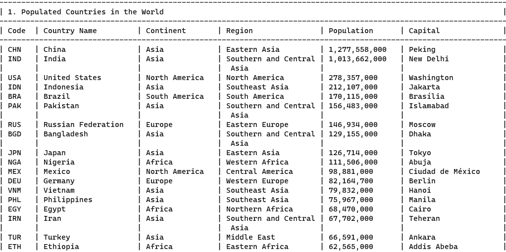  |
| 2  | All the countries in a continent organised by largest population to smallest.                                                                               | Yes | 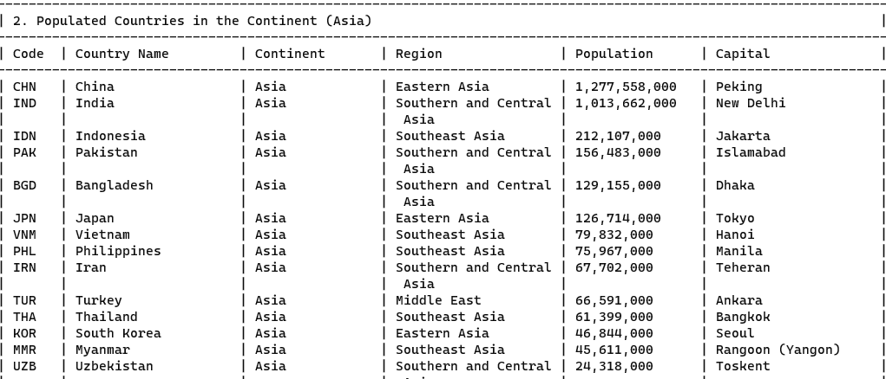  |
| 3  | All the countries in a region organised by largest population to smallest.                                                                                  | Yes | 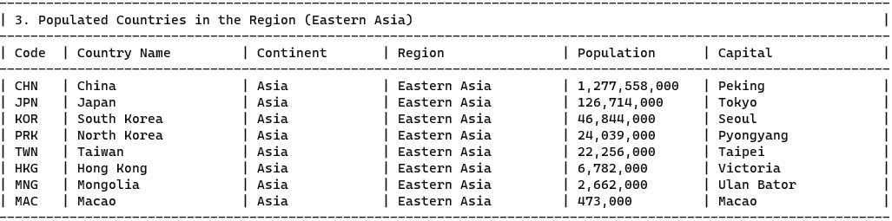  |
| 4  | The top N populated countries in the world where N is provided by the user.                                                                                 | Yes | 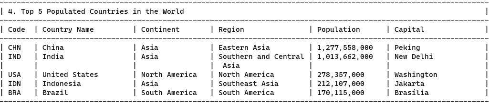  |
| 5  | The top N populated countries in a continent where N is provided by the user.                                                                               | Yes | 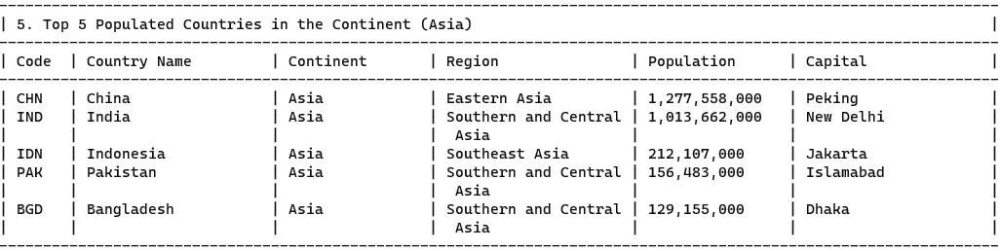  |
| 6  | The top N populated countries in a region where N is provided by the user.                                                                                  | Yes | 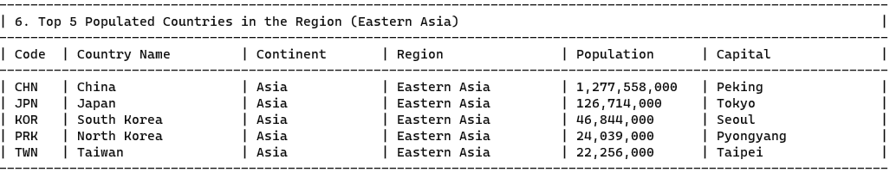  |
| 7  | All the cities in the world organised by largest population to smallest.                                                                                    | Yes | 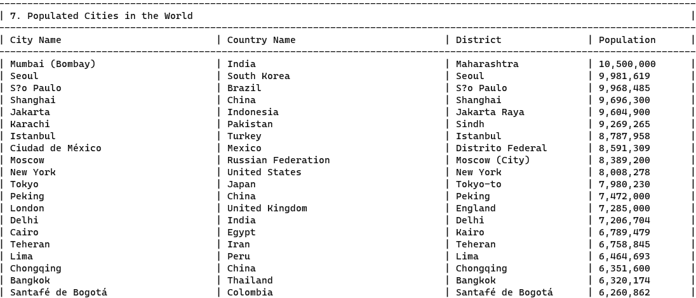  |
| 8  | All the cities in a continent organised by largest population to smallest.                                                                                  | Yes | 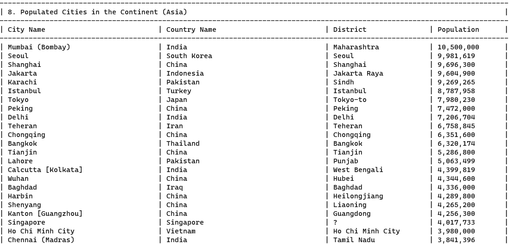  |
| 9  | All the cities in a region organised by largest population to smallest.                                                                                     | Yes | 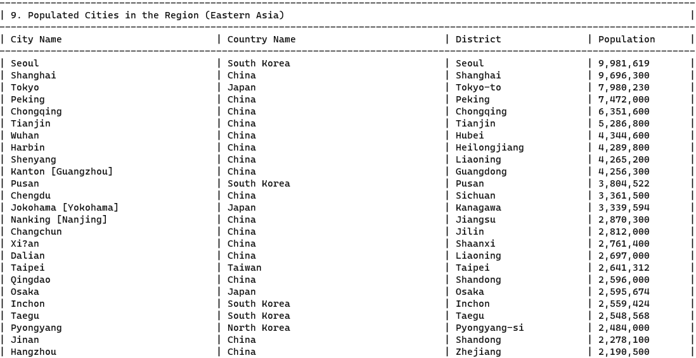  |
| 10 | All the cities in a country organised by largest population to smallest.                                                                                    | Yes | 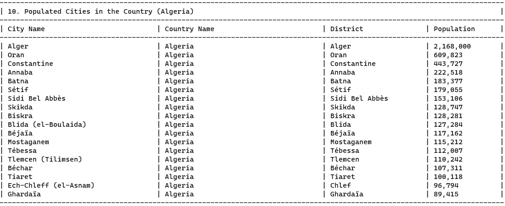 |
| 11 | All the cities in a district organised by largest population to smallest.                                                                                   | Yes | 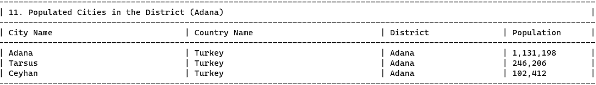 |
| 12 | The top N populated cities in the world where N is provided by the user.                                                                                    | Yes | 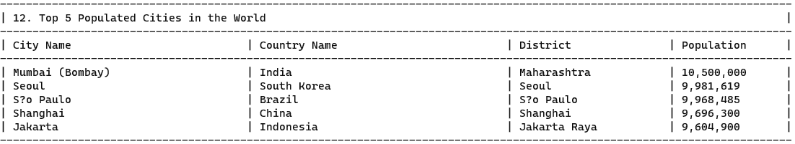 |
| 13 | The top N populated cities in a continent where N is provided by the user.                                                                                  | Yes | 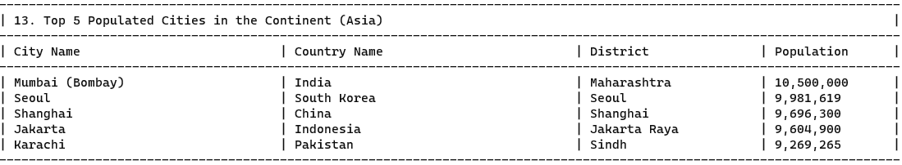 |
| 14 | The top N populated cities in a region where N is provided by the user.                                                                                     | Yes | 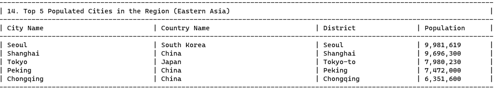 |
| 15 | The top N populated cities in a country where N is provided by the user.                                                                                    | Yes | 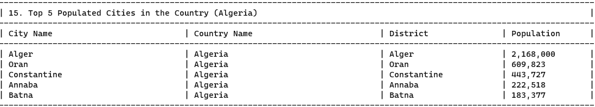 |
| 16 | The top N populated cities in a district where N is provided by the user.                                                                                   | Yes | 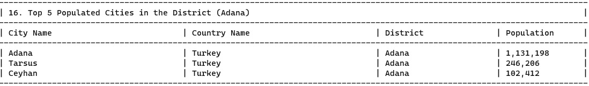 |
| 17 | All the capital cities in the world organised by largest population to smallest.                                                                            | Yes | 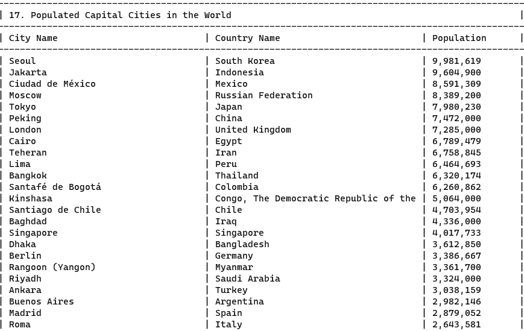 |
| 18 | All the capital cities in a continent organised by largest population to smallest.                                                                          | Yes | 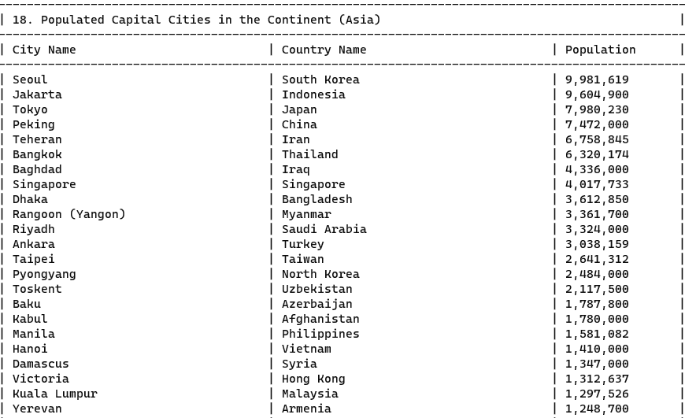 |
| 19 | All the capital cities in a region organised by largest to smallest.                                                                                        | Yes | 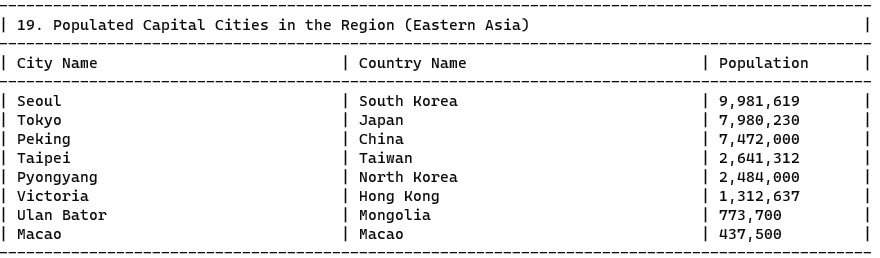 |
| 20 | The top N populated capital cities in the world where N is provided by the user.                                                                            | Yes | 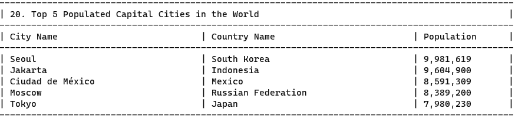 |
| 21 | The top N populated capital cities in a continent where N is provided by the user.                                                                          | Yes | 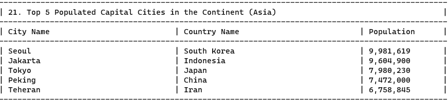 |
| 22 | The top N populated capital cities in a region where N is provided by the user.                                                                             | Yes | 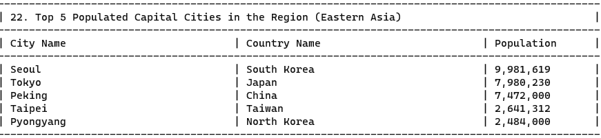 |
| 23 | The population of people, people living in cities, and people not living in cities in each continent.                                                       | Yes | 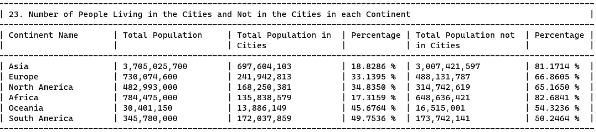 |
| 24 | The population of people, people living in cities, and people not living in cities in each region.                                                          | Yes | 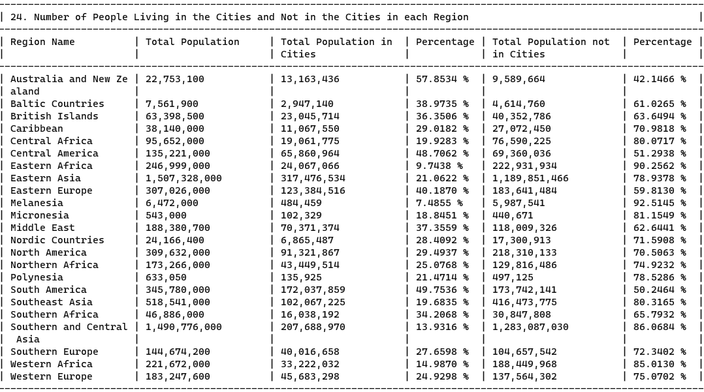 |
| 25 | The population of people, people living in cities, and people not living in cities in each country.                                                         | Yes | 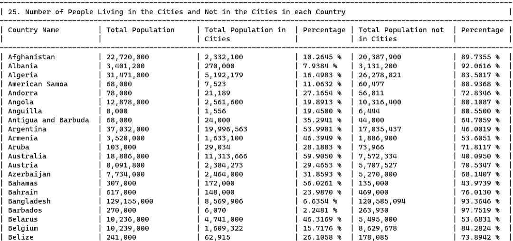 |
| 26 | The population of the world.                                                                                                                                | Yes | 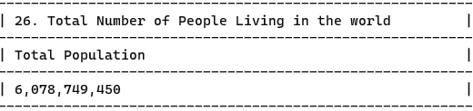 |
| 27 | The population of a continent.                                                                                                                              | Yes | 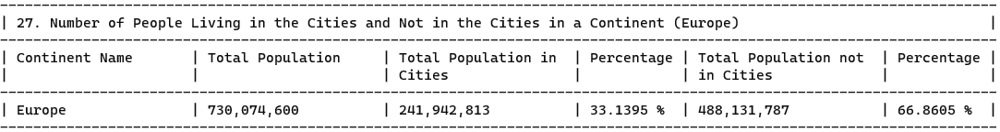 |
| 28 | The population of a region.                                                                                                                                 | Yes | 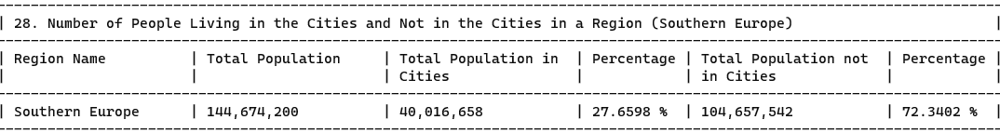 |
| 29 | The population of a country.                                                                                                                                | Yes | 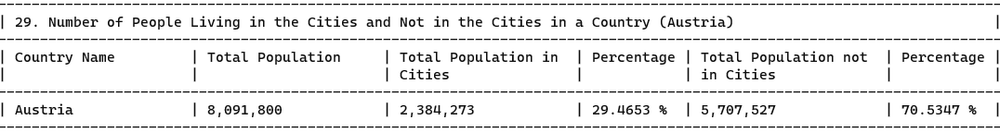 |
| 30 | The population of a district.                                                                                                                               | Yes | 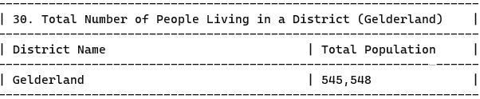 |
| 31 | The population of a city.                                                                                                                                   | Yes | 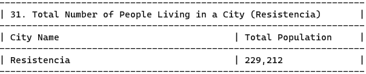 |
| 32 | The number of people who speak Chinese, English, Hindi, Spanish, Arabic from greatest number to smallest, including the percentage of the world population. | Yes | 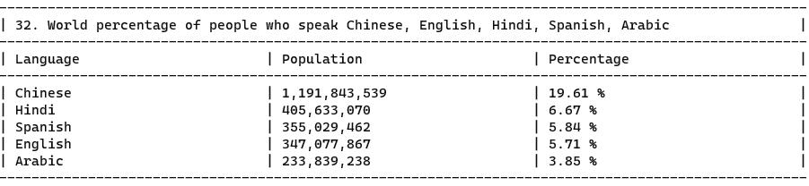 |

